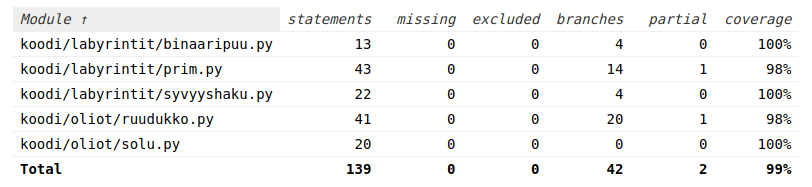

# Ohjelman testaus ja testikattavuusraportti

Ohjelman testaus on suoritettu Pytestillä, jonka avulla on luotu myös testikattavuusraportti.
Sen saa auki htmlcov kansiosta avaamalla tiedoston index.html. 



Testikattavuusraportin voi luoda myös uudelleen poetryn avulla komennoilla:

```bash
poetry run coverage run --branch -m pytest
```

```bash
poetry run coverage html
```

Huom! Poetryn pitää olla asennettuna!

Sen lisäksi suorituskykyä on testattu timeitillä.

Sain tulokseksi seuraavan:

Kun 5 * 5 labyrintti luodaan binääripuualgoritmilla 10000 kertaa, aikaa kuluu: 0.7537269509994076 sekuntia

Kun 10 * 10 labyrintti luodaan binääripuualgoritmilla 10000 kertaa, aikaa kuluu: 2.914695749001112 sekuntia

Kun 20 * 20 labyrintti luodaan binääripuualgoritmilla 10000 kertaa, aikaa kuluu: 11.781283584998164 sekuntia

Kun 5 * 5 labyrintti luodaan syvyyshakualgoritmilla 10000 kertaa, aikaa kuluu: 1.445408873994893 sekuntia

Kun 10 * 10 labyrintti luodaan syvyyshakualgoritmilla 10000 kertaa, aikaa kuluu: 5.9562891440000385 sekuntia

Kun 20 * 20 labyrintti luodaan syvyyshakualgoritmilla 10000 kertaa, aikaa kuluu: 24.389734120995854 sekuntia

Kun 5 * 5 labyrintti luodaan primin algoritmilla 10000 kertaa, aikaa kuluu: 6.829108698999335 sekuntia

Kun 10 * 10 labyrintti luodaan primin algoritmilla 10000 kertaa, aikaa kuluu: 30.63342156899307 sekuntia

Kun 20 * 20 labyrintti luodaan primin algoritmilla 10000 kertaa, aikaa kuluu: 134.71887561500625 sekuntia

Testin voi toistaa suorittamalla komennon:

```bash
poetry run invoke suorituskyky
```
